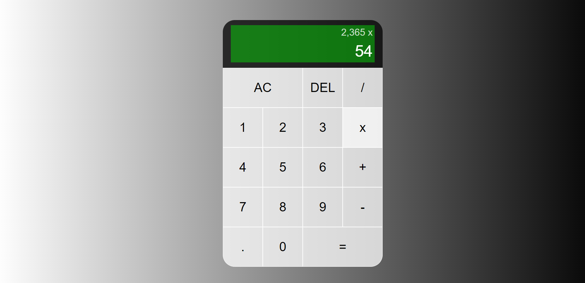
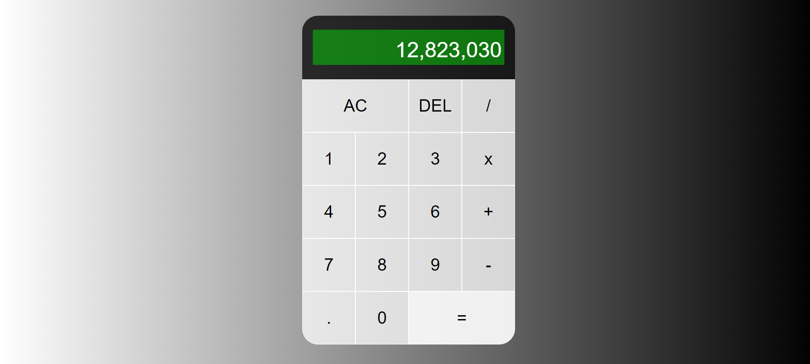

# Calculator Web App

A simple, responsive calculator web application built using **HTML**, **CSS**, and **JavaScript**. This calculator handles basic arithmetic operations including addition, subtraction, multiplication, and division.

---

## 📸 Screenshots

## 



---

## Features

- Basic operations: `+`, `-`, `x`, `/`
- Decimal support
- Deleting individual digits (`DEL`)
- Clearing all input (`AC`)
- Real-time display updates
- Elegant layout and UI

---

## 📁 Project Structure

```
project/
│
├── index.html          # Main HTML structure
├── css/
│   └── style.css       # Stylesheet for layout and appearance
├── script.js           # JavaScript logic for calculator functionality
└── img/
    └── ...             # Folder for screenshots (optional)
```

---

## 🛠️ How It Works

### HTML (`index.html`)

Defines the layout using a grid system. The calculator includes:

- Two display divs: previous and current operand
- Number buttons: 0–9 and `.`
- Operation buttons: `+`, `-`, `x`, `/`
- Utility buttons: `AC`, `DEL`, `=`

### JavaScript (`script.js`)

Handles:

- State management using a `Calculator` class
- Input appending and validation
- Operation selection and computation
- Display formatting and updates
- Event handling for all buttons

### CSS (`style.css`)

Styles the calculator layout, including:

- Responsive grid
- Screen appearance
- Button placement and appearance

---

## 🔧 Usage

1. **Clone or download** the repository.
2. Open `index.html` in any modern web browser.
3. Start calculating!

---

## ✅ Example

```
Input:  8 + 3 =
Output: 11
```

---

## 💡 Future Enhancements (Optional)

- Keyboard support
- Memory storage (M+, M-, MR)
- Scientific calculator functions
- Dark/light theme toggle

---

## 🧑‍💻 Author

Created by **Musa Dondolo**
Passionate about building interactive and practical front-end projects.

---

## 📃 License

This project is open source and free to use for educational and personal purposes.
